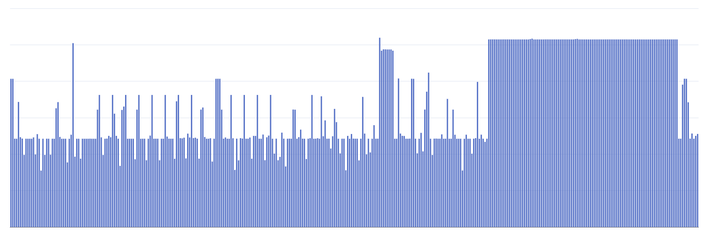
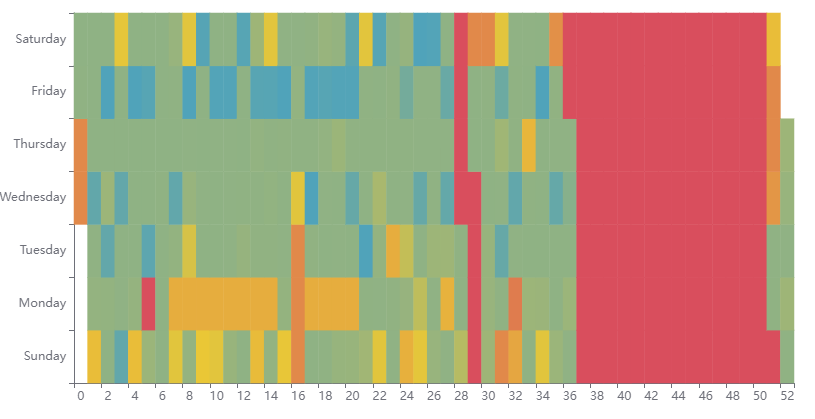

# Visualize Location History

Libraries and some tools for creating engaging visualization from location history data. 

Most easily extracted from Google Takeout.

## Examples

The implemented visualizations help showing how your year went in relation to a *anchor* location, think home/work. This lets you easily identify days where you stayed home, worked or were on a trip!

In this example, we see a week long trip in the middle of the year and a 3 month trip towards the end of the year.

## Instructions

1. Visit https://takeout.google.com/ and request downloading location history data.
2. Wait for data to be ready.
3. Download data, then run script directly on the archive downloaded, for example 

    go run .\cmd/takeout_to_chart/main.go --input=.\takeout.zip --anchors=2014-01-01,10.0,10.0:2016-02-01,20.0,20.0